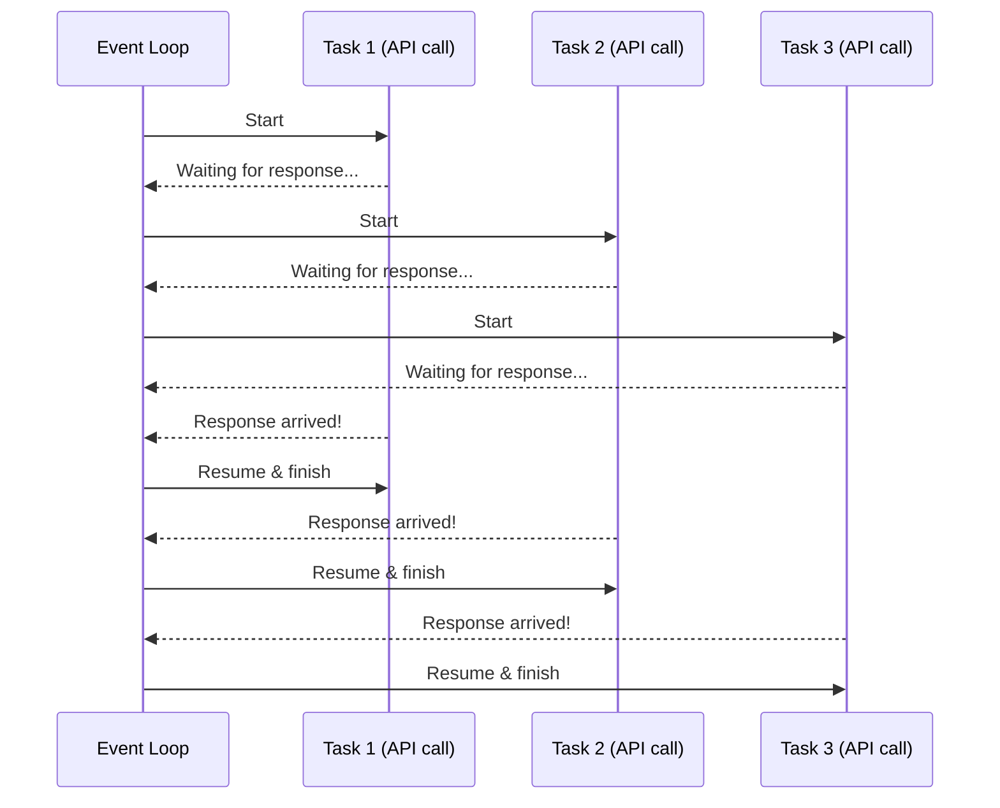

# Concurrent Programming

Imagine your program needs to complete two tasks. Task 1 makes a request to a remote database and waits for the response. Task 2 is independent of Task 1 and has no external dependencies. In a sequential program, Task 2 just... waits. It can't start until Task 1 is completely done — including all the time Task 1 spent doing nothing but waiting for a response.

That's wasteful. Concurrent programming fixes it by letting Task 2 run during Task 1's idle time.

!!! info "Part of a series"
    This page is a deep dive into one of three parallel programming paradigms. For the big picture and a framework for choosing between them, start with the [Parallel Programming overview](parallel-programming.md).

## The Concurrent Supermarket Checkout

Picture a single cashier working two checkout queues. When a customer in Queue A steps aside to dig through their wallet for a credit card, the cashier doesn't just stand there waiting — they switch to Queue B and start scanning the next customer's items. When the Queue A customer is ready to pay, the cashier switches back.

The cashier never works on two customers *at the same time*. There's still just one pair of hands. But by filling what would otherwise be dead time, the cashier processes more customers per hour than if they had waited idly for each one to finish.

This is concurrency: **one worker, multiple tasks, smart switching during idle periods.**

The key insight is what triggers the switching: the cashier switches when they would otherwise be *waiting for input* (the customer's payment) or *waiting for output* (bagging to finish). These are the I/O operations of the checkout world.

## The Concurrent Where's Waldo?

Now consider the Where's Waldo? problem. You're staring at the image, scanning every square inch for that red-and-white striped character. There's no waiting — your eyes and brain are working continuously. There are no idle moments to fill with other work.

**Concurrency doesn't help here.** There's no I/O to wait for, no idle time to exploit. The bottleneck is pure computation (visual processing), not waiting. This is a CPU-bound problem, and concurrency is designed for I/O-bound problems.

This distinction is fundamental and worth burning into memory:

| Problem type | Bottleneck | Concurrency helps? |
|---|---|---|
| **I/O-bound** | Waiting for external resources (network, disk, APIs) | :white_check_mark: Yes |
| **CPU-bound** | Processor doing heavy computation | :x: No |

## How It Works: The Event Loop

Under the hood, concurrent programs use an **event loop** — a central coordinator that manages multiple tasks.

Here's the mental model:

1. The event loop starts Task 1.
2. Task 1 reaches a point where it needs to wait (e.g., sends a network request). Instead of blocking, it **yields control** back to the event loop: *"I'm waiting — go do something else."*
3. The event loop picks up the next ready task — Task 2 — and starts running it.
4. When Task 1's response arrives, the event loop puts it back on the ready queue.
5. The event loop continues switching between tasks whenever one yields.

This is **cooperative multitasking**: tasks voluntarily yield control when they start waiting. It all happens on a single thread — no multiple processors required.

The ideal speedup from concurrency is:

> **T~concurrent~ = T~sequential~ − T~idle~**

In other words, you reclaim the time that would otherwise be spent waiting. If your program spends 80% of its time waiting for I/O, concurrency can theoretically reduce your runtime by up to 80%.

### A concrete example

Consider a program that makes three HTTP requests, each taking 1 second to get a response:

- **Sequential**: 3 requests × 1 second each = **3 seconds** total
- **Concurrent**: All 3 requests fire, then wait together. Total ≈ **1 second** (the slowest request)

That's a 3× speedup — not from doing things faster, but from doing things *smarter*. The CPU wasn't doing anything useful during those waits anyway.

## When to Use Concurrent Programming

Concurrent programming is the right tool when:

- [x] Your program spends significant time **waiting for external I/O** — network requests, database queries, file downloads, API calls
- [x] The tasks are **independent** or only loosely coupled (Task 2 doesn't need Task 1's result to start)
- [x] You want to improve throughput **without additional hardware** — concurrency works on a single core
- [x] You're working with **many similar I/O operations** — downloading 500 files, querying 100 API endpoints, reading from multiple sensors

### Real-world HPC examples

- **Downloading datasets**: Fetching files from multiple URLs before a compute job starts
- **Querying multiple APIs**: Collecting data from several web services as preprocessing
- **Database operations**: Running independent queries against a research database
- **File staging**: Copying files from multiple storage locations to scratch before a job

## Limitations

Concurrency is not a universal performance tool. Keep these limitations in mind:

**No speedup for CPU-bound work.** If your program's bottleneck is computation (crunching numbers, transforming data, training a model), concurrency won't help. The event loop can only exploit *idle* time, and there is none. You need [parallel computing](parallel-computing.md) instead.

**Adds code complexity.** Concurrent code requires you to think about task lifecycles, error handling across concurrent operations, and the order in which results arrive (which may differ from the order you started them). Debugging can be harder because the execution order is non-deterministic.

**Event loop overhead.** The event loop itself takes some CPU time to manage task switching. For tasks with very short wait times, this overhead can eat into your gains.

**Not all libraries support it.** For concurrent I/O to work, the I/O library itself must be "async-aware" — it must know how to yield control back to the event loop instead of blocking. A regular synchronous HTTP library, for example, will block the entire event loop while waiting, defeating the purpose. You need async-compatible libraries.

## Key Concepts

| Concept | Definition |
|---|---|
| **Concurrency** | Overlapping the execution of multiple tasks, typically on a single processor, by interleaving them |
| **Event loop** | The central coordinator that switches between tasks when they yield |
| **Coroutine** | A function that can pause (yield) and resume — the building block of concurrent programs |
| **I/O-bound** | A workload dominated by waiting for external resources, not by computation |
| **Cooperative multitasking** | Tasks voluntarily yield control (as opposed to being forcibly interrupted) |

## What's Next

- [**Parallel Computing**](parallel-computing.md) — When your bottleneck is CPU, not I/O
- [**Distributed Computing**](distributed-computing.md) — When you need to scale beyond a single machine
- [**Parallel Programming overview**](parallel-programming.md) — Revisit the comparison and decision framework
