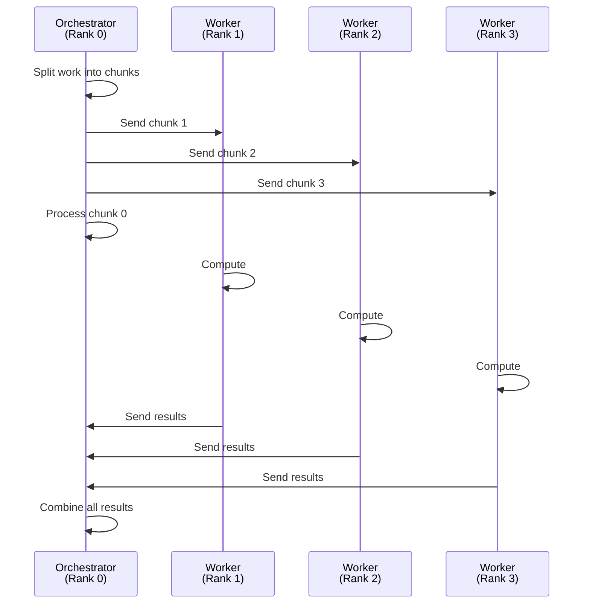

# Distributed Computing

Parallel computing harnesses multiple cores within a single machine. But a single machine has limits — a typical CPU has 4 to 128 cores, and the machine has a fixed amount of memory. What if your problem needs more?

Distributed computing breaks through these limits by spreading work across **multiple machines** connected by a network. {{ cluster.name }} has over 6,000 CPU cores across hundreds of nodes. Distributed computing is how you tap into that collective power.

!!! info "Part of a series"
    This page is a deep dive into one of three parallel programming paradigms. For the big picture and a framework for choosing between them, start with the [Parallel Programming overview](parallel-programming.md).

## The Distributed Supermarket Checkout

Your supermarket is overwhelmed. Even with every checkout lane open, the lines stretch to the back of the store. The solution? **Direct the overflow to other stores in the chain.** Each store operates independently with its own cashiers and lanes, and you can keep adding stores as demand grows.

This is distributed computing: scaling out across multiple independent systems, each with its own resources. The throughput can grow almost without limit — but now you need logistics to coordinate between stores (which store handles which customers, how do you collect the total sales at the end of the day?).

## The Distributed Where's Waldo?

Sixty-four people sit in 64 separate rooms, each with their own laptop. You **mail each person a section** of the image. Each person searches their section independently and sends back their result. If Waldo is in section 37, person 37 reports "Found him!" and you're done.

The search itself is fast — 64 people working simultaneously. But notice the overhead that didn't exist in the parallel version:

- **Distributing the data**: You had to *send* each section to each room (network transfer)
- **Collecting results**: You had to *receive* answers back from all 64 people
- **Coordination**: Someone had to decide how to split the image and who gets which piece

That communication overhead is the fundamental cost of going distributed.

## The Message-Passing Model

In distributed computing, each process runs on a potentially different machine and has its **own private memory**. There's no shared memory to read from — if Process A has data that Process B needs, Process A must explicitly **send a message** containing that data, and Process B must explicitly **receive** it.

This is the **message-passing model**, and it's the dominant paradigm for distributed HPC. The most widely used standard for message passing is MPI (Message Passing Interface).

A typical pattern looks like this:

One process (often called **rank 0**) acts as the orchestrator: it divides the work, distributes it to worker processes, and collects the results. Each worker process runs independently in its own memory space, potentially on a different physical machine.

!!! note "Rank = process ID in MPI"
    In MPI terminology, each process is assigned a unique integer called its **rank**, starting at 0. If you launch 8 MPI processes, they are numbered rank 0 through 7. Rank 0 conventionally serves as the coordinator.

## Communication Overhead

Communication is the price of distribution. Every message between processes costs time:

- **Network latency**: Even on a high-speed cluster interconnect, sending a message takes time (microseconds to milliseconds depending on message size and network)
- **Serialization**: Data must be packed into a format suitable for transmission and unpacked at the other end
- **Synchronization**: If Process B can't continue until it receives data from Process A, it sits idle waiting — that's wasted compute time

The practical impact: **more processes means more communication, which means diminishing returns.**

### Task granularity matters

Consider splitting 128 tasks across different numbers of workers:

| Workers | Tasks per worker | Communication overhead |
|---|---|---|
| 2 | 64 each | Minimal — just 2 send/receive pairs |
| 8 | 16 each | Moderate — 8 send/receive pairs |
| 32 | 4 each | High — 32 pairs, each for only 4 tasks |
| 128 | 1 each | Extreme — 128 pairs, communication may dominate |

If each task is small, the time spent sending and receiving may exceed the time saved by distributing. This is the **granularity tradeoff**: tasks need to be large enough that the computation time dwarfs the communication time.

Amdahl's Law still applies here, but with a twist: the "serial fraction" now includes **communication time**. Every send, receive, and synchronization point adds to the portion of your program that can't be parallelized.

### Choosing the right decomposition

How you split the work matters enormously. An uneven split means some workers finish early and sit idle while others are still computing. This **load imbalance** wastes the resources you're paying for.

```mermaid
gantt
    title Load Balance: Even vs. Uneven
    dateFormat X
    axisFormat %s

    section Even Split
    Worker 0    :a, 0, 10
    Worker 1    :b, 0, 10
    Worker 2    :c, 0, 10
    Worker 3    :d, 0, 10

    section Uneven Split
    Worker 0    :e, 0, 16
    Worker 1    :f, 0, 6
    Worker 2    :g, 0, 4
    Worker 3    :h, 0, 4
```

In the uneven case, Workers 1–3 finish and idle while Worker 0 grinds through its oversized chunk. The total wall-clock time is determined by the *slowest* worker.

## When to Use Distributed Computing

Distributed computing is the right tool when:

- [x] Your problem is **too large for a single machine** — either too many CPU cores needed or too much memory required
- [x] The workload **scales well** with more processors — adding workers yields meaningful speedup
- [x] You have **access to a cluster** like {{ cluster.name }}
- [x] The expected speedup **justifies the additional complexity** of distributed programming

### The scale advantage

The reason distributed computing dominates HPC is simple: it's the only paradigm that scales beyond a single machine. A single {{ cluster.name }} node might have 20–40 cores. The cluster as a whole has thousands. If your problem benefits from 200 cores, you *must* distribute it across multiple nodes.

### When *not* to distribute

Don't default to distributed computing just because you're on a cluster. If your workload fits on a single node, [parallel computing](parallel-computing.md) is simpler, faster (no network overhead), and easier to debug. Only distribute when you have to.

## Combining Paradigms

Real-world HPC applications often combine paradigms for maximum performance:

- **Distributed + Parallel**: Use MPI to spread work across nodes, and within each node use multiple threads or processes to leverage all available cores. This is the classic **hybrid MPI + OpenMP** pattern.
- **Distributed + Concurrent**: An orchestrator process might use async I/O to manage communication with many workers without blocking.

These hybrid approaches extract the most performance from cluster hardware, but they also combine the complexity of multiple paradigms. Start simple — go hybrid only when profiling shows you need it.

## Limitations

**Communication overhead.** The more processes communicate, the more time is spent on messaging instead of computing. Fine-grained tasks that require frequent data exchange between processes may see little or no speedup — or even slowdowns.

**Debugging difficulty.** When something goes wrong in a distributed program, the bug might involve timing-dependent interactions between processes running on different machines. Reproducing and diagnosing such bugs is significantly harder than debugging sequential or even parallel code.

**Load balancing.** Uneven work distribution means some processes idle while others are overloaded. Achieving good load balance requires understanding your problem's structure and sometimes dynamic redistribution of work.

**Amdahl's Law compounds.** The serial fraction now includes not just inherently sequential code, but also all communication and synchronization. As you add more nodes, the relative cost of communication grows, eventually dominating the computation.

**Infrastructure dependency.** Your program's performance depends on the cluster's network interconnect, not just its CPUs. A slow or congested network can bottleneck an otherwise well-parallelized application.

## What's Next

Ready to write distributed code? Start with these recipes:

- [**MPI Hello World**](../recipes/mpi/hello-world.md) — Your first multi-process program on {{ cluster.name }}
- [**mpi4py**](../recipes/mpi/mpi4py.md) — Distributed computing in Python with MPI

Or explore the other paradigms:

- [**Parallel Computing**](parallel-computing.md) — When your problem fits on one machine
- [**Concurrent Programming**](concurrent-programming.md) — When your bottleneck is I/O, not CPU
- [**Parallel Programming overview**](parallel-programming.md) — Revisit the comparison and decision framework
