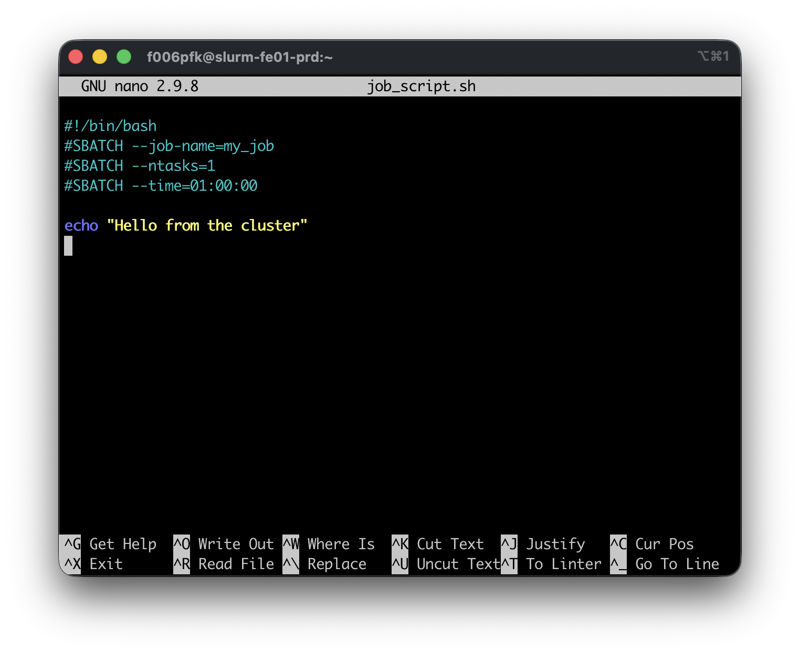

# Editing Files in the Terminal

When you're logged into {{ cluster.name }}, there's no graphical text editor: No VS Code window you can click into, no Notepad. If you need to edit a file, fix a typo in a job script, update a config file, or jot down a quick note, you need a **terminal-based editor**.

Two editors are available everywhere: **nano** and **vi** (or its improved variant, **vim**). They take completely different approaches, and both are worth knowing.

| | nano | vi / vim |
|---|---|---|
| Learning curve | Gentle: controls shown on screen | Steep: modal editing, nothing on screen |
| Best for | Quick edits, beginners | Power users, complex edits |
| Available on | Nearly all Linux systems | Every Linux system, always |
| Mouse support | Sometimes | Rarely (depends on config) |

While vi is the more powerful editor, we recommend to **start with nano for quick edits**. Learn enough vi to escape it when you accidentally end up inside it. That will happen inevitably because many tools use vi as their default text editor (e.g., git).

---

## nano

nano is the friendliest terminal editor. When you open a file, the controls are printed at the bottom of the screen. You don't have to memorize anything to get started.

### Opening a file

```bash
nano job_script.sh    # (1)!
nano new_file.txt     # (2)!
```
1. If a file of that name exists, nano will open it.
2. If there is no existing file under that name, nano will create a new one.

The screen looks like this:



The `^` symbol means ++ctrl++. So `^X` means ++ctrl+x++.

### Essential nano controls

| Keys | Action |
|------|--------|
| ++ctrl+o++ then ++enter++ | Save the file ("Write Out") |
| ++ctrl+x++ | Exit nano (prompts to save if unsaved changes) |
| ++ctrl+w++ | Search for text |
| ++ctrl+k++ | Cut the current line |
| ++ctrl+u++ | Paste the cut line |
| ++ctrl+g++ | Open help |
| Arrow keys | Move the cursor |

### A typical nano session

1. Open the file: `nano job_script.sh`
2. Use the arrow keys to navigate to the line you want to change
3. Make your edit
4. Press ++ctrl+o++ then ++enter++ to save
5. Press ++ctrl+x++ to exit

That's it. nano is intentionally simple.

!!! tip "Searching in nano"
    Press ++ctrl+w++, type a search term, and press ++enter++. Press ++ctrl+w++ again to find the next match. Press ++ctrl+c++ to cancel the search.

---

## vi and vim

vi is the oldest and most universally available terminal editor. **vim** ("Vi IMproved") is the modern version and what you almost always get when you type `vi` on a modern system. On {{ cluster.name }}, `vi` opens vim.

vi is powerful but has a reputation for being confusing. This is largely because it's **modal**: The same keys do different things depending on what mode you're in. This trips up almost everyone the first time and there are many memes about the alleged difficulty of exiting vi (seriously, google it).

### The two essential modes

vi has multiple modes, but two cover nearly everything you need:

| Mode | What it does | How to enter it |
|------|--------------|-----------------|
| **Normal mode** | Navigate, delete, copy, paste | Press ++esc++ |
| **Insert mode** | Type text | Press ++i++ |

When you first open vi, you're in **normal mode**. Typing letters won't insert text — they're commands. You must press ++i++ before you can type.

This is the source of most vi confusion: people open vi, try to type, and end up executing a cascade of commands instead. When in doubt, press ++esc++ to get back to normal mode.

### Opening a file

```bash
vi job_script.sh
vim job_script.sh    # same thing on most systems
```

### Surviving vi: the minimum you need

**Step 1 — Enter insert mode:**

Press ++i++ to start typing. You'll see `-- INSERT --` at the bottom of the screen.

**Step 2 — Make your edit.**

**Step 3 — Return to normal mode:**

Press ++esc++.

**Step 4 — Save and quit:**

Type `:wq` then press ++enter++. (`w` = write, `q` = quit)

**Step 4 (alternative) — Quit without saving:**

Type `:q!` then press ++enter++. The `!` forces the quit without saving.

!!! warning "Stuck in vi?"
    Press ++esc++ (possibly several times), then type `:q!` and press ++enter++. This exits without saving any changes. It's not elegant, but it works.

### Normal mode: navigation and editing

Once you're comfortable with insert mode and saving, normal mode becomes genuinely useful. These commands work in normal mode (after pressing ++esc++):

**Navigation:**

| Key | Action |
|-----|--------|
| ++h++ / ++l++ | Move left / right |
| ++j++ / ++k++ | Move down / up |
| Arrow keys | Also work for movement |
| `0` | Go to beginning of line |
| `$` | Go to end of line |
| `gg` | Go to top of file |
| `G` | Go to bottom of file |
| `:42` then ++enter++ | Jump to line 42 |

**Editing:**

| Key | Action |
|-----|--------|
| ++i++ | Enter insert mode before cursor |
| ++a++ | Enter insert mode after cursor |
| ++o++ | Open a new line below and enter insert mode |
| ++x++ | Delete character under cursor |
| `dd` | Delete (cut) the current line |
| `yy` | Yank (copy) the current line |
| ++p++ | Paste after cursor |
| ++u++ | Undo |
| ++ctrl+r++ | Redo |

**Searching:**

| Key | Action |
|-----|--------|
| `/pattern` then ++enter++ | Search forward |
| `?pattern` then ++enter++ | Search backward |
| ++n++ | Next match |
| ++shift+n++ | Previous match |

**Saving and quitting (always from normal mode):**

| Command | Action |
|---------|--------|
| `:w` | Save (write) without quitting |
| `:wq` or `ZZ` | Save and quit |
| `:q` | Quit (only if no unsaved changes) |
| `:q!` | Quit without saving (discard changes) |

!!! tip "Why learn vi at all?"
    vi is guaranteed to be present on every Linux system. That even includes minimal container images, embedded systems, and remote servers where nothing else is installed. If you're deep inside a container or on an emergency recovery shell, vi may be your only option.

---

## Choosing between them

Use **nano** when:

- You're making a quick fix to a job script
- You're new to terminal editors
- You don't need anything fancy

Use **vi** when:

- nano isn't available (rare, but happens in containers)
- You're already in vi and need to make a change
- You want to invest in learning an editor that will serve you anywhere

For longer editing sessions, like writing analysis scripts, building complex pipelines, consider using **VS Code with the Remote-SSH extension** to edit files on {{ cluster.name }} from your laptop with a full graphical interface. See [Connecting to {{ cluster.name }}](../getting-started/connecting.md) for details.

---

## Quick Reference

### nano

| Keys | Action |
|------|--------|
| ++ctrl+o++ → ++enter++ | Save |
| ++ctrl+x++ | Exit |
| ++ctrl+w++ | Search |
| ++ctrl+k++ | Cut line |
| ++ctrl+u++ | Paste line |

### vi / vim

| Keys | Action |
|------|--------|
| ++i++ | Enter insert mode |
| ++esc++ | Return to normal mode |
| `:wq` → ++enter++ | Save and quit |
| `:q!` → ++enter++ | Quit without saving |
| `dd` | Delete line |
| `yy` / ++p++ | Copy / paste line |
| `/pattern` → ++enter++ | Search |
| ++u++ | Undo |

## What's Next

- [**Linux: Permissions, Pipes & the Environment**](linux-advanced.md): File permissions, pipes, and shell configuration
- [**Storage on {{ cluster.name }}**](storage.md): Understand where your files live and how to manage them
