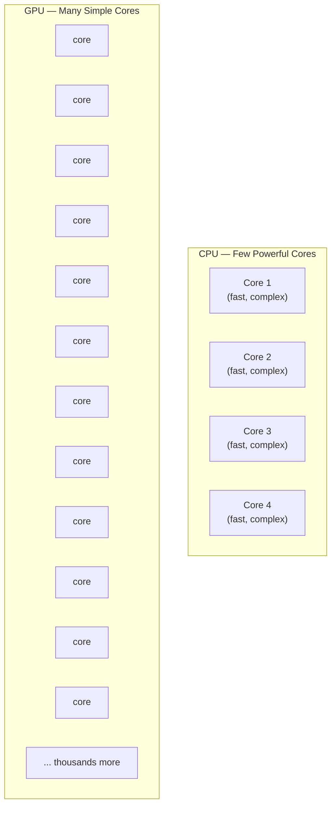

# GPU Computing

GPUs have gone from graphics cards to the engines powering modern AI research. But they aren't magic accelerators that make every program faster — they're specialized hardware with a specific strength: doing the same operation on enormous amounts of data at the same time. Understanding what GPUs are good at (and what they're not) will help you use them effectively on {{ cluster.name }}.

## What is a GPU?

A CPU (central processing unit) is designed for sequential work. It has a small number of large, powerful cores — typically 8 to 128 on a modern server — each with fast clock speeds, large caches, and sophisticated branch prediction logic. A CPU is optimized for running one complex task as quickly as possible.

A GPU (graphics processing unit) was originally built to push millions of pixels to a screen simultaneously. Every pixel update is a simple calculation — transform a coordinate, apply a color value — but there are millions of them per frame, and they all need to happen at once. That design principle: *thousands of simple operations running in parallel*, turned out to be exactly what deep learning, scientific simulation, and signal processing need.

A modern GPU has thousands of smaller, simpler cores compared to a CPU's dozens of large, complex ones. The tradeoff is intentional: each GPU core is much slower than a CPU core when running a single task, but the GPU wins decisively when the same operation must be applied across massive datasets.



The analogy: a CPU is a handful of expert surgeons, each capable of extremely complex work. A GPU is a stadium full of assembly-line workers, each performing a simple step — but all at the same time.

## When GPUs Help (and When They Don't)

Not every workload benefits from a GPU. Understanding the distinction will save you from wasting GPU allocations (a scarce shared resource) and help you write faster code.

### Where GPUs excel

- **Matrix and tensor operations** — the foundation of neural network training and inference. Multiplying two large matrices is embarrassingly parallel: every output element can be computed independently.
- **Image and signal processing** — applying filters, transforms, or convolutions across millions of pixels or samples.
- **Molecular dynamics** — simulating forces on large numbers of particles simultaneously.
- **Monte Carlo methods** — running thousands of independent random simulations at once.
- **Anything expressible as "apply this operation to every element of a large array"** — if you can write it with NumPy broadcasting, a GPU can likely accelerate it.

### Where GPUs struggle

- **Sequential logic with many branches** — `if/else` chains and loops where each step depends on the result of the previous one can't be parallelized.
- **Small workloads** — copying data to GPU memory takes time. If the computation itself is short, that overhead dominates and you'll be slower than a CPU.
- **Random memory access patterns** — GPUs are optimized for contiguous memory access. Workloads that scatter-read from unpredictable locations see poor performance.
- **Irregular, graph-like problems** — traversing a tree or following linked pointers is fundamentally sequential.

!!! tip "A practical rule of thumb"
    If your code uses NumPy, SciPy, or similar array operations extensively, it can probably benefit from a GPU. If it uses many `if/else` statements and loops over individual items — where each iteration depends on the last — it probably won't.

## GPU Memory

GPUs have their own dedicated memory, called VRAM (video RAM), that is physically separate from the system RAM your CPU uses. This separation matters: to use a GPU, your data must first be copied from system RAM into VRAM. Most GPU-accelerated libraries handle this transparently, but the VRAM capacity sets a hard ceiling on how much data you can process at once.

A typical GPU on {{ cluster.name }} has between 16 GB and 80 GB of VRAM depending on the model. When your job fails with an "out of memory" error on the GPU, it means you've exceeded *VRAM* — not system RAM. The most common cause is a batch size that's too large. Reducing `batch_size` in your training loop is usually the first fix to try.

!!! tip "Monitoring VRAM in real time"
    Run `nvidia-smi` from an interactive session on the GPU node to see which GPUs are present, their current utilization percentage, and how much VRAM each process is consuming.

## CUDA — The Bridge to the GPU

CUDA (Compute Unified Device Architecture) is NVIDIA's programming toolkit that lets your code communicate with the GPU. It provides the low-level interface between software and GPU hardware. Most GPU-accelerated Python libraries — PyTorch, TensorFlow, JAX, CuPy — use CUDA under the hood.

You generally don't write CUDA directly. Your library handles that layer. But you do need the right *version* of CUDA installed — one that is compatible with both your specific GPU hardware and the version of the library you're using. Version mismatches are one of the most common sources of frustrating GPU setup failures.

This is why the [PyTorch recipe](../recipes/python/pytorch.md) has you verify the CUDA version before installing: installing PyTorch built against CUDA 11.8 on a node that only has CUDA 12.x drivers (or vice versa) will silently fall back to CPU-only execution — or fail outright.

!!! info "CUDA vs. ROCm"
    CUDA is NVIDIA-specific. AMD GPUs use a different toolkit called ROCm. {{ cluster.name }} uses NVIDIA GPUs, so CUDA is what you need here.

## Available GPUs on {{ cluster.name }}

{{ cluster.name }} has multiple GPU types spread across different partitions. GPU hardware is upgraded over time, so the specific models available change. To see what GPU types are in each partition right now, run:

```bash
sinfo -o "%P %G"
```

This prints each partition name alongside the generic resources (GRES) it offers, including GPU types. GPU partitions are separate from CPU-only partitions — you must explicitly target a GPU partition in your job script, and you must explicitly request a GPU with `--gres`. Jobs submitted to a CPU partition will not have access to any GPU, even if the node happens to have one.

!!! note "Checking GPU availability"
    To see how many GPUs are currently free vs. in use across all GPU partitions, run `sinfo -p gpu --Format=nodes,cpus,gres,gresused`.

## Requesting GPUs in Slurm

To run a GPU job, your `sbatch` script needs two key directives beyond the usual resource requests: `--partition` pointing at a GPU partition, and `--gres` to actually allocate one or more GPUs.

```bash
#!/bin/bash
#SBATCH --partition=gpu          # GPU partition (check available partitions with sinfo)
#SBATCH --gres=gpu:1             # Request 1 GPU
#SBATCH --ntasks=1
#SBATCH --cpus-per-task=4        # CPUs to feed data to the GPU
#SBATCH --mem=16G                # System RAM (separate from GPU VRAM)
#SBATCH --time=01:00:00

# Your GPU job commands go here
python train.py
```

`--gres=gpu:N` requests *N* GPUs. Most single-model training jobs only need one. If you need a specific GPU type — for example, because your model requires 80 GB of VRAM only available on an A100 — you can request it explicitly:

```bash
#SBATCH --gres=gpu:a100:1        # Request specifically an A100
```

The `--cpus-per-task` value matters here. GPUs are fast enough that the bottleneck often shifts to the CPU-side data loading pipeline. A common starting point is 4 CPU cores per GPU to keep the data preprocessor from becoming the bottleneck.

!!! warning "Don't request GPUs you won't use"
    GPUs are a scarce shared resource. Submitting CPU-only jobs to GPU partitions — or requesting multiple GPUs when your code only uses one — wastes resources that other researchers need and pushes your own future jobs further back in the queue. Slurm will not automatically reclaim unused GPUs mid-job.

## Checking GPU Utilization

Knowing whether your code is actually using the GPU effectively is just as important as getting it to run. `nvidia-smi` shows all GPUs on the node, their utilization percentage, current VRAM consumption, and the processes using them.

```bash
nvidia-smi
```

A one-time snapshot is useful for a quick check. For live monitoring during a run, use `watch` to refresh it every second:

```bash
watch -n 1 nvidia-smi
```

Run this from an interactive session on the same node where your job is executing. If GPU utilization is consistently sitting below 50%, your job is likely bottlenecked somewhere else — most commonly in data loading. The GPU is waiting for the CPU to prepare the next batch. Solutions include increasing `--cpus-per-task`, using a more efficient data loader, or prefetching data into memory before training starts.

!!! tip "PyTorch-specific profiling"
    For PyTorch jobs, `torch.cuda.utilization()` and `torch.cuda.memory_summary()` give you GPU stats from within Python, which can be more convenient than shelling out to `nvidia-smi` during development.

## What's Next

With the conceptual groundwork in place, these recipes walk you through using GPUs for real workloads:

- [**PyTorch with GPU Support**](../recipes/python/pytorch.md) — how to install PyTorch with the right CUDA version and verify your GPU is recognized
- [**Transformers & HuggingFace**](../recipes/python/transformers.md) — running large language models and fine-tuning on {{ cluster.name }}
- [**Submit Your First Job**](../getting-started/first-job.md) — if you haven't written an `sbatch` script before, start here for the Slurm basics
