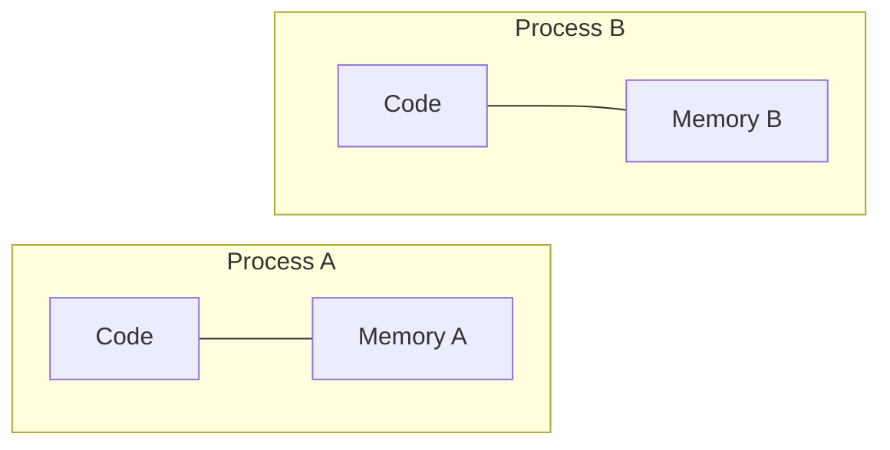
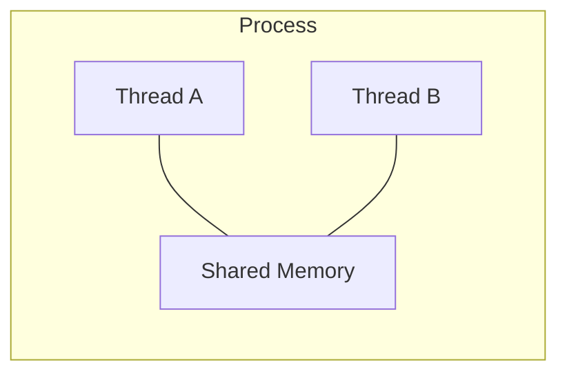

# Parallel Computing

Concurrency fills idle time. Parallel computing does something fundamentally different: it puts multiple processors to work *at the same time*, each executing a portion of the overall computation simultaneously. There's no waiting to exploit — just raw work being divided across hardware.

If your bottleneck is the CPU (not I/O), this is the paradigm you need.

!!! info "Part of a series"
    This page is a deep dive into one of three parallel programming paradigms. For the big picture and a framework for choosing between them, start with the [Parallel Programming overview](parallel-programming.md).

## The Parallel Supermarket Checkout

Instead of one clever cashier switching between queues, you now have **two cashiers at two separate checkout lanes**, each independently processing their own line of customers. Throughput goes up — potentially by 2×.

Add more lanes and more cashiers, and throughput keeps scaling (up to a point — we'll get to that). This is true parallelism: multiple workers doing real work at the same time.

## The Parallel Where's Waldo?

Eight people gather around a single large image. Each person is assigned one section of the picture and searches only their section. Since the search is pure computation (no waiting for anything), having 8 people looking simultaneously can find Waldo up to **8× faster** than one person searching alone.

This works because:

- The task is **CPU-bound** — everyone's brain is fully engaged the whole time
- The work can be **divided** into independent sections
- Each section can be processed **without needing results from any other section**

## Processes, Threads, and CPUs

Before going deeper, let's nail down some terminology that's often used loosely:

| Term | What it is |
|---|---|
| **Process** | An independent execution unit managed by the operating system, with its own private memory space. Think of it as a separate running instance of a program. |
| **Thread** | A lighter-weight execution flow *within* a process. Threads share the parent process's memory — they can all read and write the same data. |
| **CPU (core)** | A physical processing unit that can execute instructions. A modern processor chip contains many cores. |
| **Task** | A unit of work assigned to a process or thread. |

A single process can contain multiple threads, and the operating system maps processes and threads onto physical CPU cores.

## Processes vs. Threads

The choice between processes and threads shapes the entire character of your parallel program:

### Processes — isolated but safe

- Each process has its **own memory space** — no sharing
- Data must be **explicitly copied** between processes
- **Higher overhead** to create and destroy (the OS must allocate new memory)
- **No race conditions** from shared state — processes can't accidentally corrupt each other's data
- The safer, simpler model when tasks are independent

### Threads — fast but dangerous

- All threads in a process share the **same memory**
- Data is **immediately accessible** to all threads — no copying needed
- **Low overhead** to create and destroy
- **Risk of race conditions**: if two threads read and write the same variable at the same time, the result can be unpredictable and wrong
- Requires careful synchronization (locks, barriers, etc.)

| | Processes | Threads |
|---|---|---|
| Memory | Private (isolated) | Shared |
| Spawn overhead | Higher | Lower |
| Data sharing | Explicit (copy/send) | Implicit (direct access) |
| Race conditions | Not from shared state | Yes — must be managed |
| Best for | Independent tasks, safety | Fine-grained sharing, speed |

!!! tip "When in doubt, use processes"
    For most scientific and data-processing workloads, processes are the right default. The tasks are usually independent, the data can be partitioned cleanly, and you avoid an entire class of bugs (race conditions) by keeping memory isolated.

## Scheduling

Having 8 threads doesn't mean you're doing 8 things simultaneously. **True parallelism requires separate physical CPU cores.** If you create 8 threads but only have 4 cores, the operating system will time-share — rapidly switching threads on and off cores, giving the *illusion* of simultaneous execution but not the actual speedup.

This is called **oversubscription**, and it can actually make things *slower* due to the overhead of constantly switching contexts. The OS handles scheduling automatically, but you should be aware:

!!! warning "Match workers to cores"
    When requesting resources on {{ cluster.name }}, make sure the number of processes or threads you launch matches the number of CPU cores you've been allocated. Launching more workers than cores wastes scheduler resources and hurts performance.

## Amdahl's Law

Here's the most important equation in parallel computing. It tells you the theoretical maximum speedup you can achieve by parallelizing your program:

$$
S = \frac{1}{(1 - P) + \frac{P}{n}}
$$

Where:

- **S** = speedup (how many times faster the parallel version is)
- **P** = fraction of your program that can be parallelized (0 to 1)
- **n** = number of processors

### What this means intuitively

If 90% of your program can be parallelized (P = 0.9), the remaining 10% is inherently sequential — it *must* run on a single core. That serial portion becomes the bottleneck:

| Processors (n) | Speedup (P = 0.9) | Speedup (P = 0.5) |
|---|---|---|
| 2 | 1.8× | 1.3× |
| 4 | 3.1× | 1.6× |
| 8 | 4.7× | 1.8× |
| 16 | 6.4× | 1.9× |
| 64 | 8.8× | 2.0× |
| ∞ | **10×** | **2×** |

Even with *infinite* processors, the 10% serial fraction limits you to a 10× speedup. And if only half your code is parallelizable, you'll never exceed 2×, no matter how many cores you throw at it.

The practical lesson is stark: **before parallelizing, measure your serial fraction.** If it's large, no amount of hardware will help — you need to rethink the algorithm.

The red sections are your ceiling. Making the green section infinitely fast still leaves the red.

## The Python GIL

If you work in Python, there's one more thing you need to know. CPython (the standard Python interpreter) has a **Global Interpreter Lock (GIL)** — a mechanism that allows only one thread to execute Python bytecode at a time, even on a multi-core machine.

This means:

- **Threads in Python do not give you CPU parallelism.** Even with 8 threads on 8 cores, only one thread runs Python code at any given instant.
- **For CPU-bound parallel work in Python, use processes** — each process gets its own Python interpreter (and its own GIL), enabling true parallel execution.
- **The GIL doesn't affect I/O-bound work** — threads yield the GIL while waiting for I/O, which is why threading works fine for concurrency (see [Concurrent Programming](concurrent-programming.md)).
- **Compiled extensions can release the GIL.** Libraries like NumPy, SciPy, and pandas perform their heavy computation in C/Fortran code that releases the GIL, so operations like matrix multiplication *can* benefit from threading.

!!! note "This is a Python-specific constraint"
    Languages like C, C++, Fortran, Rust, and Java do not have a GIL. Threads in those languages achieve true parallelism without this limitation. If you use Python as "glue" around compiled extensions, the GIL often isn't a practical concern.

## When to Use Parallel Computing

Parallel computing is the right tool when:

- [x] Your program is **CPU-bound** — the processor is the bottleneck, not I/O
- [x] The work can be **divided** into chunks that are independent or mostly independent
- [x] The computation and data **fit on a single machine** — you have enough cores and memory on one node
- [x] The individual tasks are **large enough** to justify the overhead of spawning workers

### The embarrassingly parallel sweet spot

The easiest parallel problems are **embarrassingly parallel** — workloads that decompose into completely independent tasks with no communication between them:

- Processing a batch of images with the same filter
- Running a simulation with 1,000 different parameter sets
- Scoring a model against many independent test cases

For these problems, you often don't even need a parallel programming framework. A **Slurm job array** — where the scheduler runs your script many times, each with a different input — is frequently the simplest and most effective approach.

## Limitations

**Spawn overhead.** Creating processes takes time and memory. If your tasks are tiny (microseconds each), the overhead of spawning workers may exceed the time saved by parallelizing. Parallel computing pays off when individual tasks are substantial.

**Memory pressure.** Each process gets its own copy of the program's memory. Launching 16 processes that each load a 2 GB dataset requires 32 GB of RAM. Plan your resource requests accordingly.

**Amdahl's ceiling.** The serial fraction of your code caps your maximum speedup, regardless of how many cores you use. There's always a point of diminishing returns.

**Synchronization complexity.** If tasks need to share intermediate results or coordinate (e.g., in iterative algorithms), you must manage synchronization carefully. This is where race conditions, deadlocks, and other concurrency bugs live.

## What's Next

- [**Distributed Computing**](distributed-computing.md) — When your problem outgrows a single machine
- [**Concurrent Programming**](concurrent-programming.md) — When your bottleneck is I/O, not CPU
- [**Parallel Programming overview**](parallel-programming.md) — Revisit the comparison and decision framework

Or jump to a recipe:

- [**MPI Hello World**](../recipes/mpi/hello-world.md) — Distributed parallelism on {{ cluster.name }}
- [**mpi4py**](../recipes/mpi/mpi4py.md) — MPI in Python
