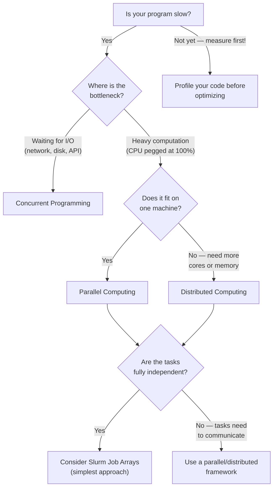

# Parallel Programming

Modern computers — from laptops to HPC nodes — contain multiple processors. A typical {{ cluster.name }} compute node has dozens of CPU cores, and the cluster as a whole has thousands. Yet the "default" way most people write code is *sequential*: one instruction after another, on a single core. That leaves an enormous amount of computing power sitting idle.

Parallel programming is the practice of structuring your code so that multiple things happen at the same time (or at least appear to). Done well, it can turn a computation that takes days into one that takes hours — or minutes.

But "parallel programming" is an umbrella term that covers several distinct paradigms, each suited to different kinds of problems. Choosing the wrong one is a common and costly mistake. This article introduces all three paradigms, compares them, and gives you a framework for choosing.

## Two Problems to Think About

Throughout this section, we'll use two recurring analogies to build intuition. They represent two fundamentally different kinds of goals.

### The Supermarket Checkout Problem

Imagine a busy supermarket. Customers are lining up, and your goal is **maximum throughput** — processing as many customers per minute as possible. How you organize cashiers, lanes, and queues determines your throughput.

### The Where's Waldo? Problem

You have a large, detailed image and need to find Waldo. Your goal is **minimum time-to-answer** — the fastest possible "Time-to-Waldo." How you divide up the search determines how quickly you find him.

These two problems respond differently to each programming paradigm, which is exactly what makes them useful for building intuition.

## Three Paradigms at a Glance

| | Concurrent | Parallel | Distributed |
|---|---|---|---|
| **What it does** | Interleaves tasks on one processor | Executes tasks simultaneously on multiple cores | Spreads tasks across multiple machines |
| **Hardware** | Single CPU | Multi-core (one machine) | Multi-node (cluster) |
| **Best for** | I/O-bound work | CPU-bound work | CPU-bound work at scale |
| **Supermarket** | One cashier switching between queues during idle moments | Two cashiers, two lanes | Overflow customers to other stores |
| **Waldo** | :x: Doesn't help — no idle time | 8 people each search a section | 64 people in 64 rooms, sections mailed out |
| **Deep dive** | [Concurrent Programming →](concurrent-programming.md) | [Parallel Computing →](parallel-computing.md) | [Distributed Computing →](distributed-computing.md) |

## How to Choose

The right paradigm depends on the shape of your problem. Here's a practical decision framework:

### The key questions

1. **Is your bottleneck I/O or CPU?**
    - If your program spends most of its time *waiting* for network responses, disk reads, or database queries, it's **I/O-bound**. Concurrent programming can fill that idle time with useful work.
    - If your program spends most of its time *computing*, it's **CPU-bound**. You need more processors, not better scheduling.

2. **Does it fit on one machine?**
    - If the computation and data fit within a single node's CPU cores and memory, **parallel computing** on that node is simpler and has less overhead.
    - If you need more cores or memory than a single node provides, you need **distributed computing** across multiple nodes.

3. **Are the tasks independent?**
    - If your workload can be split into completely independent pieces (no communication needed between them), it's **embarrassingly parallel**. In that case, a Slurm job array — where you simply run your script many times on different inputs — is often the simplest and most effective solution. No special framework required.

## The No-Free-Lunch Tradeoff

Going beyond sequential code can deliver dramatic speedups. But there's always a cost:

!!! warning "Runtime vs. development time"
    Every parallel paradigm trades *runtime* for *development time*. Concurrent code requires reasoning about task scheduling. Parallel code requires reasoning about shared state and synchronization. Distributed code requires reasoning about communication and failure modes. The further you go down this list, the more complex your code becomes.

Before reaching for any parallel paradigm, ask yourself:

- **Have I measured?** Don't guess where the bottleneck is. Profile your code first.
- **Is the speedup worth it?** If parallelizing saves 10 minutes of runtime but costs 10 hours of development, you need to run the code at least 60 times to break even.
- **Is there a simpler approach?** Sometimes a better algorithm or a compiled library (like NumPy instead of pure Python loops) eliminates the need for parallelism entirely.

## What's Next

Dive into the paradigm that matches your problem:

- [**Concurrent Programming**](concurrent-programming.md) — Fill idle time when your program waits for I/O
- [**Parallel Computing**](parallel-computing.md) — Harness multiple cores for CPU-intensive work
- [**Distributed Computing**](distributed-computing.md) — Scale beyond a single machine across the cluster

Or jump straight to a recipe:

- [**MPI Hello World**](../recipes/mpi/hello-world.md) — Your first distributed program on {{ cluster.name }}
- [**mpi4py**](../recipes/mpi/mpi4py.md) — Distributed computing in Python with MPI
