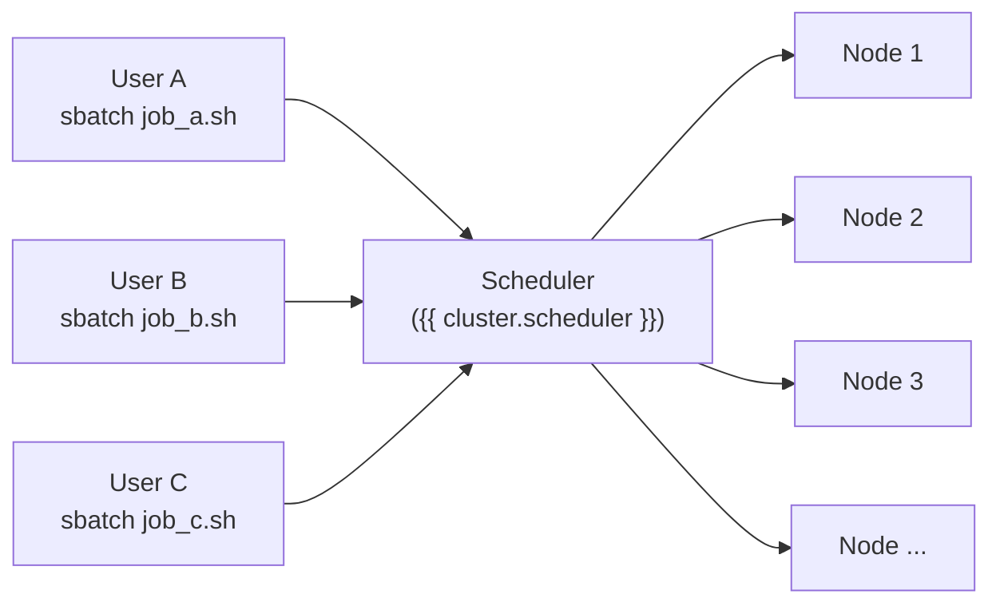
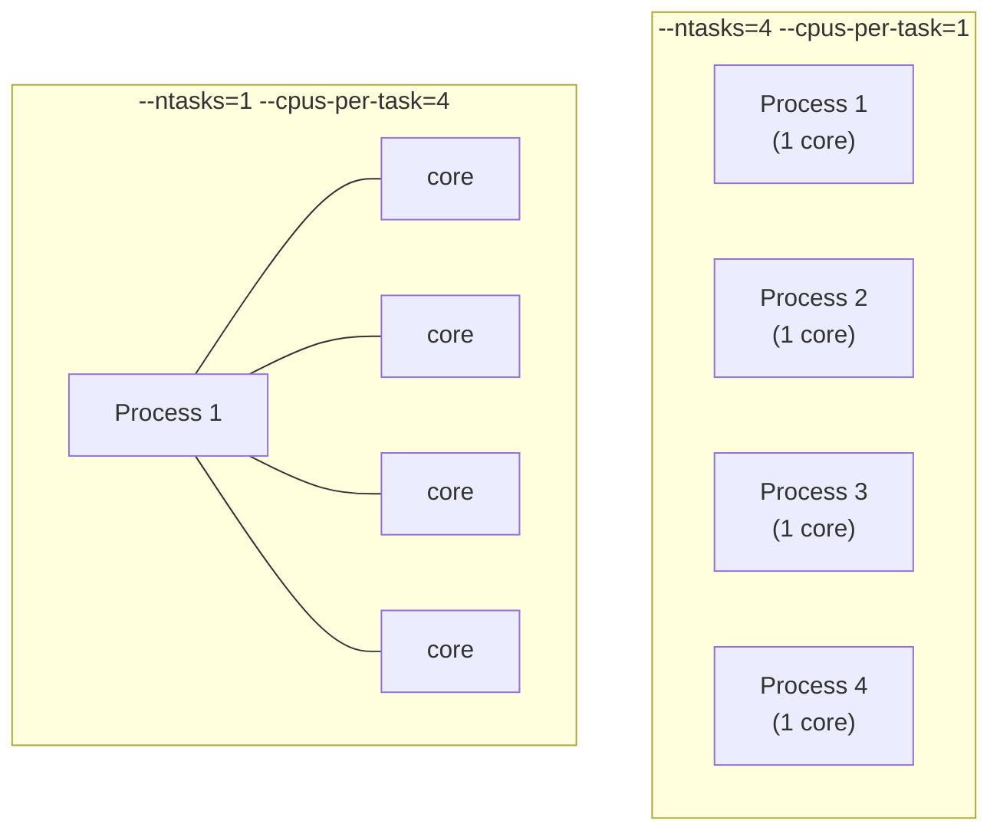
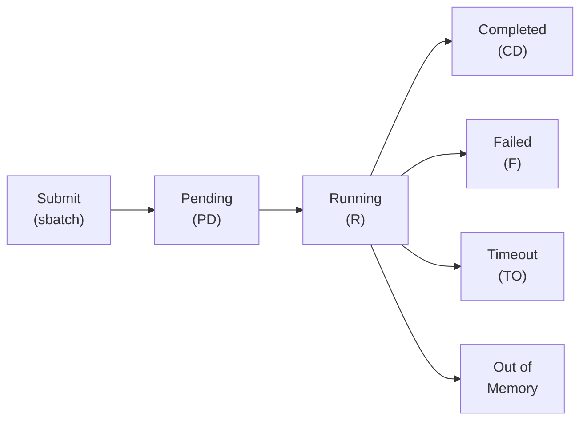

# Job Scheduling

If you've [submitted your first job](../getting-started/first-job.md), you've already used the scheduler. You wrote a script, asked for some resources, and the cluster ran it somewhere. But what actually happened between `sbatch` and your output file appearing? Why did your job wait in the queue? And how do you know whether you asked for the right amount of resources?

This page explains how {{ cluster.scheduler }} — the scheduler on {{ cluster.name }} — manages the cluster's resources, decides what runs when, and why the choices you make in your `#SBATCH` directives directly affect how long you wait and how well your job runs.

## Why Schedulers Exist

Imagine a shared kitchen with 50 cooks and one industrial oven. If everyone just walked up and used the oven whenever they wanted, chaos would follow: someone's soufflé gets interrupted mid-bake, two people try to set different temperatures, and the cook with the biggest dish monopolizes the oven all day while everyone else waits.

An HPC cluster faces the same problem at a much larger scale. {{ cluster.name }} has thousands of CPU cores, terabytes of memory, and dozens of GPUs — but also hundreds of researchers who all need them. Without coordination, one user could accidentally (or intentionally) consume the entire machine, leaving everyone else staring at a login node.

The **scheduler** is the solution. It's a program that sits between users and compute resources, accepting job requests, deciding priority, and allocating resources fairly. No user talks to the hardware directly — everyone goes through the scheduler.



On your laptop, you run a program and it starts immediately using whatever resources it can grab. On a cluster, you *request* specific resources, and the scheduler decides when and where to grant them. This is the fundamental shift in thinking: **you don't run programs on {{ cluster.name }} — you ask {{ cluster.scheduler }} to run them for you.**

## The Resource Model

Every job you submit requests four things, whether you realize it or not: **CPUs**, **memory**, **time**, and a **partition**. Understanding what each means — and especially the difference between two ways of requesting CPUs — is the key to writing effective job scripts.

### CPUs: tasks vs. cores per task

This is the single most confusing aspect of {{ cluster.scheduler }} for new users, and it matters more than anything else for getting your jobs to run correctly.

{{ cluster.scheduler }} gives you two knobs for requesting CPU resources:

- **`--ntasks`** — how many separate *processes* to launch
- **`--cpus-per-task`** — how many CPU cores each process can use

These aren't interchangeable. They map to fundamentally different parallelism strategies.

**`--ntasks=4 --cpus-per-task=1`** launches **4 separate processes**, each with 1 core. This is the model for MPI programs, where multiple independent processes communicate by passing messages. Each process has its own memory space and its own copy of your program.

**`--ntasks=1 --cpus-per-task=4`** launches **1 process** that can use **4 cores internally**. This is the model for multithreaded programs — a single process that spawns threads to parallelize work. Python's `multiprocessing`, NumPy's internal threading, and OpenMP all work this way.



The total CPU count is the same in both cases (4 cores), but the *structure* is completely different — and using the wrong one means your job either can't parallelize at all, or creates processes that fight over a single core.

Here's a simple decision framework:

| Your workload | What to request | Example |
|---|---|---|
| Single-process, single-core | `--ntasks=1 --cpus-per-task=1` | A basic Python or R script |
| Single-process, multithreaded | `--ntasks=1 --cpus-per-task=N` | NumPy/pandas with internal threading, OpenMP programs |
| Multi-process (MPI) | `--ntasks=N --cpus-per-task=1` | MPI programs (`mpirun ./my_program`) |
| Hybrid (MPI + threads) | `--ntasks=N --cpus-per-task=M` | MPI program where each rank uses OpenMP threads |

!!! tip "When in doubt, use `--ntasks=1 --cpus-per-task=N`"
    Most research code — Python scripts, R analyses, MATLAB jobs — runs as a single process. If you're not using MPI, set `--ntasks=1` and adjust `--cpus-per-task` based on whether your code can use multiple cores. If you're not sure whether your code is multithreaded, start with `--cpus-per-task=1` and check CPU efficiency afterward with `seff`.

### Memory

Memory (`--mem`) sets the maximum RAM your job can use. If your job exceeds this, {{ cluster.scheduler }} kills it immediately — no warning, no graceful shutdown. The job exits with state `OUT_OF_MEMORY`.

```bash
#SBATCH --mem=16G         # 16 GB total for the entire job
```

For MPI jobs where memory needs scale with the number of processes, `--mem-per-cpu` is often more natural:

```bash
#SBATCH --mem-per-cpu=4G  # 4 GB per core (8 tasks × 4G = 32G total)
```

The [Intermediate Slurm Patterns](../recipes/slurm/intermediate-patterns.md) recipe covers the details of choosing between these two options.

### Time

The `--time` directive sets a **wall-clock time limit** — the maximum real-world time your job is allowed to run. When the clock runs out, {{ cluster.scheduler }} kills the job, regardless of whether it's 99% done.

```bash
#SBATCH --time=04:00:00   # 4 hours (HH:MM:SS)
```

Requesting the right amount of time is a balancing act. Too little and your job gets killed before it finishes. Too much and you wait longer in the queue (we'll explain why in the next section). A good starting strategy is to estimate your runtime, then add 25–50% as a buffer.

!!! tip "Benchmark first"
    Run your analysis on a small subset of your data — either in an [interactive session](../recipes/slurm/interactive-jobs.md) or as a short batch job — to get a reliable runtime estimate before committing to a long run.

### Partitions

A **partition** is a logical grouping of nodes, typically organized by hardware type or intended use. {{ cluster.name }} has multiple partitions — some for general CPU work, some for GPU jobs, some for short jobs, some for long-running analyses.

Each partition has its own rules: maximum time limit, maximum number of CPUs per job, which users can access it, and what hardware is available. You can see all available partitions and their limits with:

```bash
sinfo -o "%20P %10l %5a %10D %20G"
```

This shows each partition's name, time limit, availability, node count, and available GPUs (if any).

If you don't specify a partition, your job goes to the default partition (`{{ cluster.default_partition }}` on {{ cluster.name }}). For GPU work, you must explicitly target a GPU partition — see [GPU Computing](gpu-computing.md) for details.

## How {{ cluster.scheduler }} Decides What Runs

When you submit a job with `sbatch`, it doesn't run immediately. It enters a **queue** of pending jobs, and {{ cluster.scheduler }} decides the order based on several factors. Understanding these factors explains why some jobs start quickly and others wait — and gives you concrete levers to reduce your wait times.

### Priority factors

{{ cluster.scheduler }} assigns each pending job a **priority score** based on a combination of factors:

**Fairshare** — The most important factor. {{ cluster.scheduler }} tracks how many resources each user (and their research group) has consumed recently. If you've been running large jobs all week, your next job gets lower priority to give other users a turn. If you haven't submitted anything in days, your priority is higher. This prevents any single user from monopolizing the cluster.

**Job age** — Jobs that have been waiting longer get a gradual priority boost. This ensures that no job waits forever, even from a user with low fairshare.

**Job size** — Smaller resource requests are inherently easier to schedule because they fit into more available gaps. This isn't a priority *factor* per se, but it's a scheduling reality: a 1-core, 1-hour job has far more opportunities to start than a 64-core, 7-day job.

### Backfill scheduling

{{ cluster.scheduler }} doesn't just run jobs in strict priority order. It uses a strategy called **backfill**: while waiting for enough resources to free up for a high-priority large job, it looks for smaller, shorter jobs that can *fit in the gap* without delaying the large job.

```mermaid
gantt
    title Backfill Scheduling Example
    dateFormat HH:mm
    axisFormat %H:%M

    section Node 1
    Running Job A             :active, a1, 00:00, 02:00
    Large Job (waiting)       :crit,   a2, 02:00, 06:00

    section Node 2
    Running Job B             :active, b1, 00:00, 01:00
    ✅ Small Job (backfilled) :done,   b2, 01:00, 01:30
    Large Job (waiting)       :crit,   b3, 02:00, 06:00
```



In this example, the small job starts before the large high-priority job because it fits in the gap and finishes before the large job needs those resources. This is why **requesting less time directly translates to shorter wait times** — {{ cluster.scheduler }} can backfill your job into gaps that a longer request wouldn't fit.

!!! tip "The single most effective way to reduce wait times"
    Request only the time and resources you actually need. A 2-hour job with 4 cores has vastly more scheduling opportunities than a 24-hour job with 32 cores — even if they have the same priority score.

## The Job Lifecycle

Every job follows the same path through {{ cluster.scheduler }}:



### Common job states

| State | Code | Meaning |
|---|---|---|
| Pending | `PD` | Waiting in the queue for resources |
| Running | `R` | Executing on a compute node |
| Completing | `CG` | Finishing up (writing output, cleaning up) |
| Completed | `CD` | Finished successfully (exit code 0) |
| Failed | `F` | Exited with a non-zero exit code |
| Timeout | `TO` | Killed because it exceeded `--time` |
| Out of Memory | `OOM` | Killed because it exceeded `--mem` |
| Cancelled | `CA` | Cancelled by the user or an admin |

### Why is my job pending?

When `squeue --me` shows your job as `PD`, the `REASON` column tells you why:

| Reason | What it means | What to do |
|---|---|---|
| `Priority` | Other jobs have higher priority | Wait — your job will start as resources free up |
| `Resources` | Not enough free nodes/cores right now | Wait — or reduce your resource request |
| `QOSMaxJobsPerUserLimit` | You've hit the max concurrent jobs for your QOS | Wait for running jobs to finish, or cancel ones you don't need |
| `Dependency` | Waiting for another job to complete first | Check the upstream job's status |
| `ReqNodeNotAvail` | Requested nodes are down or reserved | Check `sinfo` for node availability |

## Essential Commands

You don't need to memorize every {{ cluster.scheduler }} command. These six cover 95% of daily use:

| Command | Purpose | Example |
|---|---|---|
| `sbatch` | Submit a batch job | `sbatch my_job.sh` |
| `squeue --me` | Check your jobs' status | `squeue --me` |
| `scancel` | Cancel a job | `scancel 12345` |
| `sinfo` | View partitions and node status | `sinfo -o "%20P %10l %5a"` |
| `sacct` | Inspect completed jobs | `sacct -j 12345 --format=JobID,State,Elapsed,MaxRSS` |
| `seff` | Human-readable efficiency report | `seff 12345` |

For batch job submission details, see [Submit Your First Job](../getting-started/first-job.md). For interactive work on compute nodes, see the [Interactive Jobs](../recipes/slurm/interactive-jobs.md) recipe. For `sacct` and `seff` in depth, see [Intermediate Slurm Patterns](../recipes/slurm/intermediate-patterns.md).

## Right-Sizing Your Requests

Getting resource requests right is an iterative process, not a guessing game. Here's the workflow experienced users follow:

### 1. Start with a reasonable estimate

For a typical single-process research script (Python, R, MATLAB), these are sensible starting points:

```bash
#SBATCH --ntasks=1
#SBATCH --cpus-per-task=1
#SBATCH --mem=4G
#SBATCH --time=01:00:00
```

Adjust upward if you know your data is large (more memory) or your computation is long (more time). If your code can use multiple cores, increase `--cpus-per-task`.

### 2. Run the job

Submit it and let it finish — or fail. Both outcomes are informative.

### 3. Check actual usage

Once the job completes, run:

```bash
seff JOBID
```

This shows you what you *actually* used versus what you requested:

```
Job ID: 12345
State: COMPLETED (exit code 0)
Cores: 1
CPU Utilized: 00:42:00
CPU Efficiency: 70.00% of 01:00:00 core-walltime
Memory Utilized: 2.80 GB
Memory Efficiency: 70.00% of 4.00 GB
```

### 4. Adjust for next time

In this example, the job used 2.8 GB of the 4 GB requested and ran for 42 minutes of the 1-hour limit. Both are comfortably within bounds — good requests. If memory efficiency were 10%, you'd cut the request in half. If the job timed out, you'd increase `--time`.

!!! warning "Over-requesting hurts you"
    It's tempting to request maximum resources "just in case." But {{ cluster.scheduler }} uses your request to schedule your job — not your actual usage. Requesting 128 GB of memory when you need 8 GB means your job can only run on nodes with 128 GB free, which are much scarcer. The result: longer queue waits for no benefit. Request what you need, plus a modest buffer.

## What's Next

You now understand the concepts behind job scheduling. Here's where to go to put them into practice:

- [**Interactive Jobs**](../recipes/slurm/interactive-jobs.md) — Get a shell on a compute node for testing and development
- [**Job Arrays**](../recipes/slurm/job-arrays.md) — Run the same analysis on many inputs simultaneously
- [**Intermediate Slurm Patterns**](../recipes/slurm/intermediate-patterns.md) — Job dependencies, advanced diagnostics, and pipeline automation
- [**GPU Computing**](gpu-computing.md) — When and how to request GPUs for your jobs
