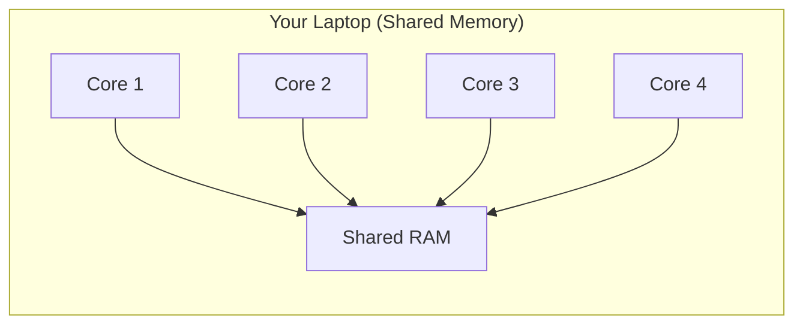
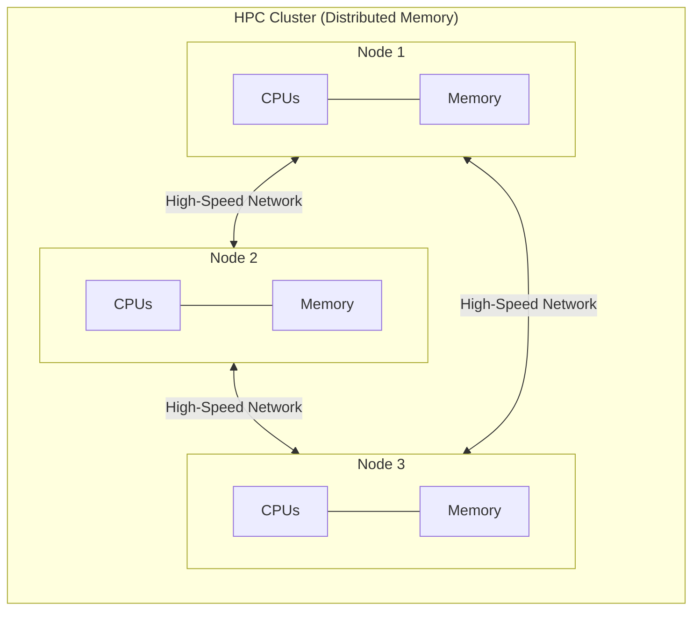

# What is HPC?

**High-Performance Computing (HPC)** is the practice of aggregating computing power to deliver much higher performance than a typical desktop or laptop can offer. Researchers use HPC to tackle problems that are too large, too slow, or too complex for a single machine. Things like simulating climate models, analyzing genomic data, or training machine learning models are all typical HPC workloads.

If you've ever found yourself waiting hours (or days) for code to finish on your laptop, HPC is likely the solution.

## Why Not Just Use a Faster Laptop?

Even the most powerful laptop has hard limits: a fixed number of CPU cores, a ceiling on memory, and limited storage. HPC systems let you go beyond these limits by connecting many machines together so they can work on a problem collaboratively.

There are two key architectural models to understand:

**Shared memory** is what you're used to. Your laptop has one pool of memory that all its CPU cores can access directly. This is simple and fast, but it doesn't scale beyond a single machine.

**Distributed memory** is the model used by HPC clusters. Many individual machines (called **compute nodes**) each have their own private memory. They communicate over a high-speed network, coordinating to solve problems that no single machine could handle alone. This is what makes it possible to run a computation across hundreds or even thousands of processors simultaneously.



## How You Interact with an HPC Cluster

Using an HPC cluster is different from using your personal computer. Here's the typical workflow:

1. **Connect** — You log in to the cluster's **login node** over SSH from your own computer.
2. **Prepare** — On the login node, you write scripts, transfer data, and set up your environment.
3. **Submit** — You submit a **job** to the scheduler, describing what you want to run and what resources it needs.
4. **Wait** — The scheduler finds available resources and runs your job. You don't need to stay connected.
5. **Collect results** — When the job finishes, you retrieve the output files.

!!! warning "The login node is shared"
    When you connect to {{ cluster.name }}, you land on the **login node** — a shared gateway used by all users. It's appropriate for lightweight tasks like editing files, submitting or monitoring jobs. **Do not run computationally intensive work on the login node.** Doing so can degrade performance for everyone. Use the scheduler to submit real work to the compute nodes.

## Key Terminology

New to HPC? Check the [glossary](../reference/glossary.md) for definitions of terms like nodes, jobs, partitions, and more that you'll encounter throughout this cookbook.

## What's Next?

Now that you have a sense of what HPC is and how {{ institution.short_name }}'s systems are organized, it's time to get hands-on:

- [**Request an account**](account.md) for our HPC systems
- [**Connect to our HPC systems**](connecting.md) via SSH
- [**Submit your first job**](first-job.md) with {{ cluster.scheduler }}
